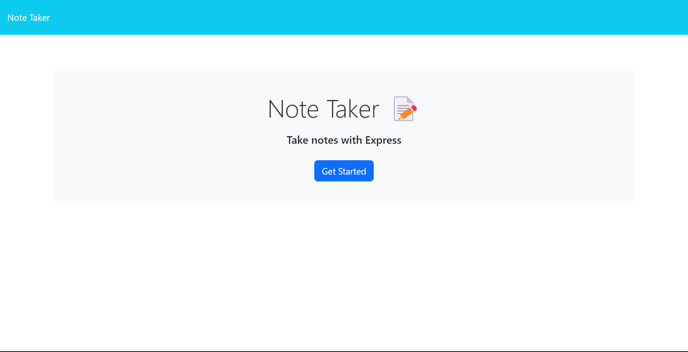
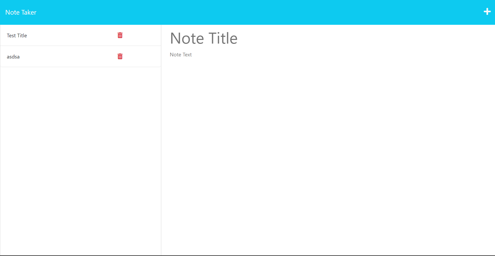
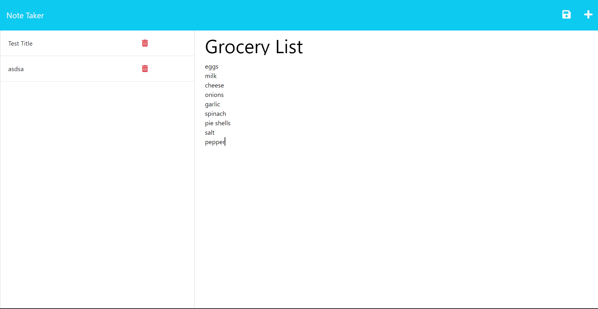
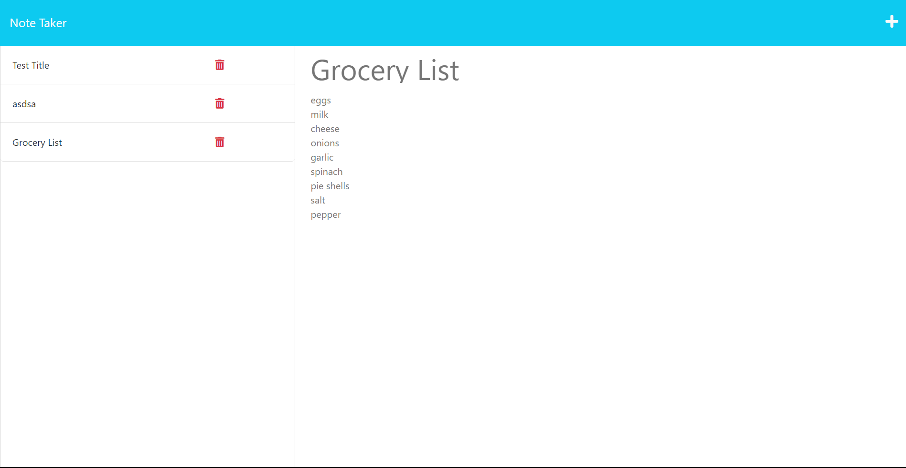

  # ExpressJS Note Taker

  ## Description

  This is an application called Note Taker that can be used to save and write notes. It uses ExpressJS in the back end and saves and retrieves notes in a JSON file.

  ## Table of Contents
   - [Description](#description)
   - [Installation](#installation)
   - [Usage](#usage)
   - [License](#license)
   - [Contributions](#contributions)
   - [License](#license)
   - [Contact Me](#contact-me)

  ## Installation

  1. Clone the repository to your machine 
  2. Install [NodeJS](https://nodejs.org/en/download) 
  3. Install Inquirer in your terminal with "npm i inquirer@8.2.4" 
  4. Install ExpressJS with your terminal with "npm install express" 
  5. Install dependencies with "npm i" 
  6. Run "node server.js" in your terminal

  ## Usage

  Open the app, click the link to the notes page, enter a new note or view previous notes, click the write button and write in your not and then press save to save it.

  
  
  
  

  See a demo of it [HERE](https://drive.google.com/file/d/1jPB9nvex0A8sTBMltWj4oLqqRBrlMvIR/view)

  ## Credits

  Starter code provided by UofT Coding Bootcamp. Back end done by me.

  ## Contributions

  [Me](https://github.com/abi-gail17)

  ## License

   Licensed by the MIT License: https://opensource.org/licenses/MIT

  ## Contact Me
  Have any Questions? Contact me at:

  [My GitHub](https://github.com/abi-gail17)

  or email me at cinco.de.abby@gmail.com

